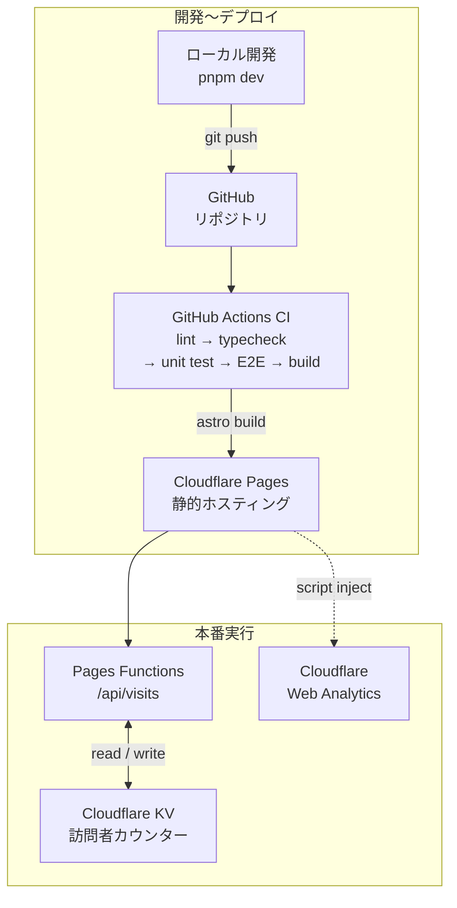

## あいさつ
はじめまして！せりと申します。JavaとAIコーディングと戯れている人間です。自分のサイトを作成したため、ご挨拶とさせていただきます。

実は、大学生のころに作った[ポートフォリオサイト](https://shion-serizawa.github.io/)（[GitHub](https://github.com/Shion-Serizawa/Shion-Serizawa.github.io)）も存在するのですが、リニューアルした形となります。理由としては以下です。
### Blogを書くための土台を作りたかった。
旧サイトにもBlogと銘打たれた場所があったのですが、完全にハリボテのものなのでした。
（2022年すなわち、4年前。。。）

社会人になって、Zennとかで以下の記事を書いたりなどはしていました。
- [ISUCONに初参加してみた！(2024. ISUCON14)](https://zenn.dev/jigjp_engineer/articles/55ddffbff7a363)
- [DBeaverのAIボタン（AI Assistant）](https://zenn.dev/jigjp_engineer/articles/3cdf0c58c98539)
- [JSpecify 1.0解説：JavaのNull安全性とIntelliJ IDEAの挙動](https://zenn.dev/jigjp_engineer/articles/6f1f5cec8509ca)

しかし、「個人的の思いみたいな場所を語る場」がないなぁと思い、このような場を作成したわけです。もちろん「はてなブログ」等もありだとは思うのですが、完全に自己責任で何でもできる場も作っておきたかったのです。

### 自由に遊べる環境を作りたかった。
旧サイトも（AIが出始めぐらいなこともあり）、Bootstrapとかで（学生気分の）丁寧に作ったものではあったものの、GitHub Pagesにデプロイする形のものになっています。
個人的に気になったこととかを試す場、もう少し自分が直接触る事ができる場があるとよいという思いが芽生えました。
（バックエンド畑なのに）このサイトは次の章に紹介する構成になっているのですが、ゆくゆくはQuarkus(Javaで盛り上がっているマイクロサービス用のJavaフレームワーク)、Kotlin（null安全性を感じたい）等も触りたいと思っています。そういったときに、このホームがHUBとして稼働してくれないかなぁなんて思っています。
- まぁ、使わないにせよ。フロントのデプロイの雰囲気は掴んだので、それが経験になったはず。

## 技術スタック

このサイトは以下の技術で構成されています。

- **フレームワーク**: [Astro](https://astro.build/) 5 — SSG（静的サイト生成）モードで動作
- **言語**: TypeScript（strict モード）
- **スタイリング**: CSS Modules + CSS カスタムプロパティ（ライト/ダークモード対応）
- **ホスティング**: Cloudflare Pages（静的配信）
- **サーバーレス**: Cloudflare Pages Functions + Cloudflare KV（訪問者カウンター）
- **アナリティクス**: Cloudflare Web Analytics（cookie 不使用）
- **CI/CD**: GitHub Actions
- **テスト**: Vitest（ユニット）+ Playwright（E2E / Chromium）
- **パッケージマネージャー**: pnpm 9
- **ツール管理**: mise
- **コンテンツ管理**: Astro Content Collections（型安全なブログ）

## アーキテクチャ

ブログの `.md` ファイルは Astro Content Collections を通じてビルド時に静的 HTML へ変換されます。
訪問者カウンターのみがサーバーサイド処理で、Cloudflare Pages Functions（`/api/visits`）と KV ストレージで動いています。

## 機能

- **ホーム**: ヒーロー・スキル概要・今やっていること
- **プロフィール**: タイムライン・スキル分類（得意 / 実務経験あり / 触ったことがある）・趣味・PC スペック
- **Works**: 制作物ポートフォリオ
- **Blog**: Markdown 記事 + タグによるクライアントサイドフィルタリング
- **訪問者カウンター**: サーバーレス API で集計、フッターに表示
- **ダーク / ライトモード**: `prefers-color-scheme` + CSS カスタムプロパティで自動切替
- **レスポンシブデザイン**: モバイル〜 PC 対応
- **SEO**: OG タグ・canonical URL
- **アクセシビリティ**: スキップリンク・ARIA ラベル

## これから
個人の目標とかプログラミング以外で語りたいことであったら、この場で語ることでになるでしょう。それでは、これからよろしくお願いします！
